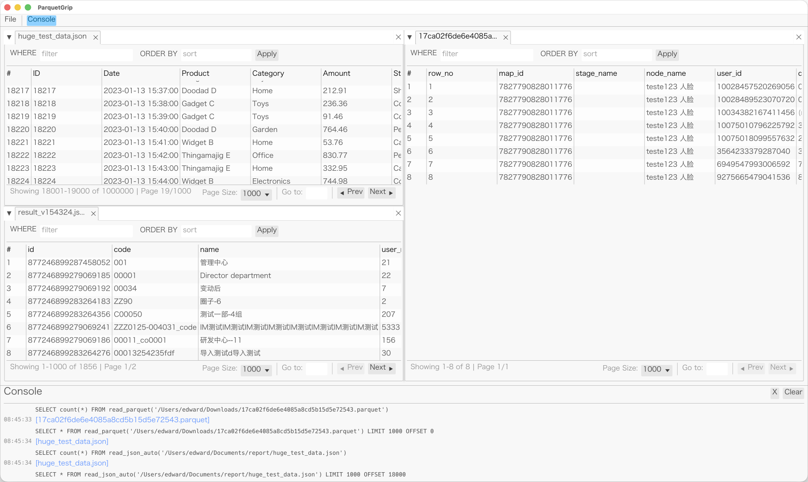

# 📊 ParquetGrip

English | [简体中文](./README.md)


**ParquetGrip** is a high-performance cross-platform data file browser built with Rust. It leverages **DuckDB** as the core query engine and **egui** to provide a fast, fluid data exploration experience.



## ✨ Features

- **Format Support**: Seamlessly browse **Parquet**, **CSV**, **JSON**, and **JSON.gz** files.
- **Blazing Fast Loading & Pagination**: Handles multi-gigabyte Parquet files with ease. Built-in pagination (LIMIT/OFFSET) ensures a smooth UI even with massive datasets.
- **DataGrip-Style Search**:
  - **SQL Filtering**: Input raw `WHERE` clauses for complex data filtering.
  - **Instant Sorting**: Use `ORDER BY` clauses for dynamic data sorting.
- **Session Persistence**: Automatically remembers your opened files, window layouts (Docking), filter conditions, and current page, allowing you to pick up right where you left off.
- **Multi-Tab Support**: Open multiple files simultaneously, switch quickly via the tab bar, and support for split-view dragging.
- **Professional Error Handling**: Dedicated, collapsible error panel with one-click copying of SQL error messages.
- **Cross-Platform Support**: Optimized font rendering and packaging for macOS, Windows, and Linux.
- **CJK Font Support**: Automatically detects and loads native system fonts (PingFang, Microsoft YaHei, Noto Sans, etc.) for perfect rendering.
- **Human-Readable Formats**:
  - **Date/Time**: Automatic conversion of native timestamps to readable strings.
  - **Null Values**: Explicit `(null)` display with subtle color coding.

## 🚀 Quick Start

### Prerequisites
- **Rust Toolchain** (1.81+ recommended)

### Run
```bash
cargo run --release
```

### Bundling
Pre-configured with `cargo-bundle` for generating native installers:
```bash
cargo install cargo-bundle
cargo bundle --release
```
Bundled artifacts (e.g., `.app` for macOS) will be located in `target/release/bundle/`.

> [!TIP]
> **Fix for "App is damaged" error on macOS**:
> Run this command in Terminal to remove the quarantine flag:
> ```bash
> sudo xattr -r -d com.apple.quarantine /Applications/ParquetGrip.app
> ```
> *You will be asked to enter your Mac login password (typing will be invisible).

## 🛠 Tech Stack

- **Engine**: [DuckDB](https://duckdb.org/)
- **UI Framework**: [egui](https://github.com/emilk/egui) & [egui_dock](https://github.com/Adanos020/egui_dock)
- **Serialization**: [Serde](https://serde.rs/)
- **CI/CD**: GitHub Actions (Automated multi-platform releases)

## ⚠️ Disclaimer & Contribution

This project is primarily developed on **macOS**. While cross-platform support for Windows and Linux is configured, **it has not been fully tested** due to lack of hardware.

If you encounter issues on non-macOS platforms or wish to help improve compatibility, **Issues and Pull Requests (PRs) are highly welcome!**

## 📝 License

This project is licensed under the [MIT License](LICENSE).
